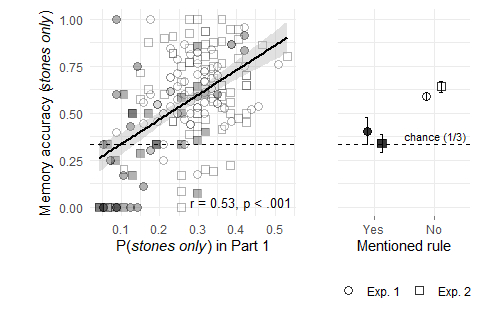

Memory Reconstruction: Experiments 1 & 2
================
2026-03-26

## Correlation between avoidance learning and memory accuracy

### All trials

Across both experiments, we tested whether participants who more
strongly avoided the stones-only position in Part 1 (higher `pstones`
avoidance, i.e. lower values) showed better reconstruction accuracy in
Part 2.

In Experiment 1, the correlation between `pstones` and overall memory
accuracy was $t(98) = 0.86$, $p = .390$. In Experiment 2, it was
$t(93) = 1.10$, $p = .276$. Across both experiments combined,
$t(193) = 1.37$, $p = .173$.

### Trials on which participants chose the stones-only position

In Experiment 1, the correlation between `pstones` and memory accuracy
on stones-only trials was $t(97) = 6.93$, $p < .001$. In Experiment 2,
it was $t(92) = 5.55$, $p < .001$. Across both experiments combined,
$t(191) = 8.73$, $p < .001$.

### Trials on which participants chose one of the other two positions

In Experiment 1, the correlation between `pstones` and memory accuracy
on non-stones trials was $t(98) = 0.16$, $p = .872$. In Experiment 2, it
was $t(93) = 0.20$, $p = .844$. Across both experiments combined,
$t(193) = 0.20$, $p = .842$.

## Difference in memory accuracy between explicit and implicit learners

### All trials

In Experiment 1, memory accuracy was 0.66 for explicit learners and 0.65
for implicit learners ($t(29.87) = 0.31$, $p = .757$). In Experiment 2,
these figures were 0.63 and 0.66 ($t(59.70) = -1.07$, $p = .289$).
Across both experiments combined, $t(82.83) = -0.50$, $p = .616$.

### Trials on which participants chose the stones-only position

Explicit learners showed *lower* memory accuracy on stones-only trials
than implicit learners. In Experiment 1, memory accuracy was 0.40 for
explicit learners and 0.59 for implicit learners ($t(24.20) = -2.44$,
$p = .022$). In Experiment 2, these figures were 0.34 and 0.64
($t(40.50) = -5.25$, $p < .001$). Combined: $t(60.56) = -5.22$,
$p < .001$.

### Trials on which participants chose one of the other two positions

In Experiment 1, memory accuracy was 0.70 for explicit learners and 0.67
for implicit learners ($t(32.81) = 0.77$, $p = .447$). In Experiment 2,
these figures were 0.67 and 0.66 ($t(46.22) = 0.37$, $p = .715$).
Combined: $t(79.69) = 0.78$, $p = .439$.

<!-- -->

Participants varied in their ability to notice the hidden rule, measured
as the probability of touching the *stones only* position in part 1. We
asked whether this variability predicted memory accuracy in part 2,
specifically for memory-inconsistent decisions (that is, selections of
the *stones only* position). If participants use their learned policy to
reconstruct past decisions, those participants who successfully learned
the hidden rule should have worse memory for decisions that are
incongruent with their current, learned policy. This is what we found.
Across both experiments, better rule learning in part 1 was negatively
correlated with memory accuracy for rule-inconsistent decisions in part
2 (Exp. 1: *r* = -0.58, \< .001; Exp. 2: *r* = -0.50, \< .001). This
effect was selective to rule-inconsistent decisions: we observed no
correlation between rule learning and memory for rule-consistent
decisions (Exp. 1: *r* = -0.02, .872; Exp. 2: *r* = -0.02, .844; pooled:
*r* = -0.01, .842). Furthermore, when asked at the end of the experiment
if they noticed a regularity in the location of gems, a subset of 22
participants in Exp. 1 and 25 participants in Exp. 2 mentioned the
position of boxes. These “explicit learners” had significantly *worse*
memory for their rule-inconsistent decisions than did other participants
(Exp. 1: 0.40 vs. 0.59, $t(24.20) = -2.44$, $p = .022$; Exp. 2: 0.34
vs. 0.64, $t(40.50) = -5.25$, $p < .001$). Again, this effect was
selective for memory for rule-inconsistent actions. No group differences
were observed for memory-consistent actions (Exp. 1: 0.70 vs. 0.67,
$t(32.81) = 0.77$, $p = .447$; Exp. 2: 0.67 vs. 0.66, $t(46.22) = 0.37$,
$p = .715$; pooled: $t(79.69) = 0.78$, $p = .439$).
